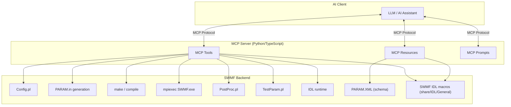
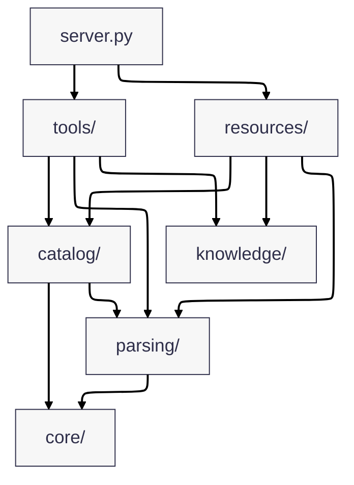
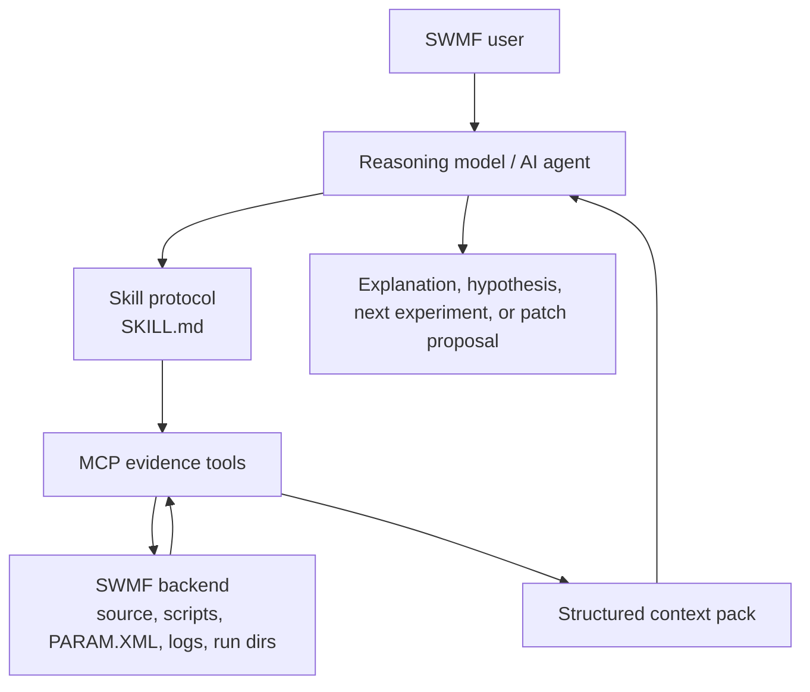
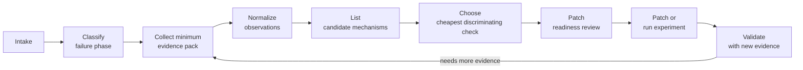
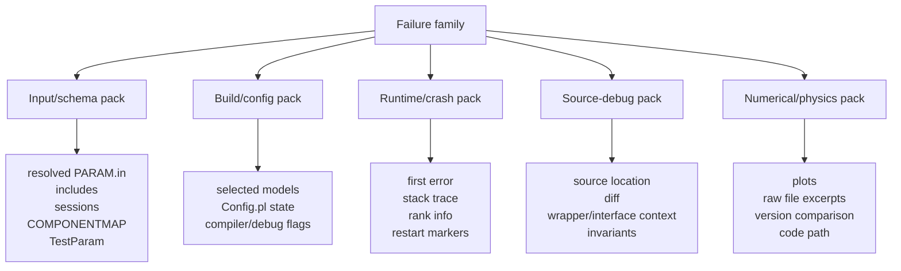
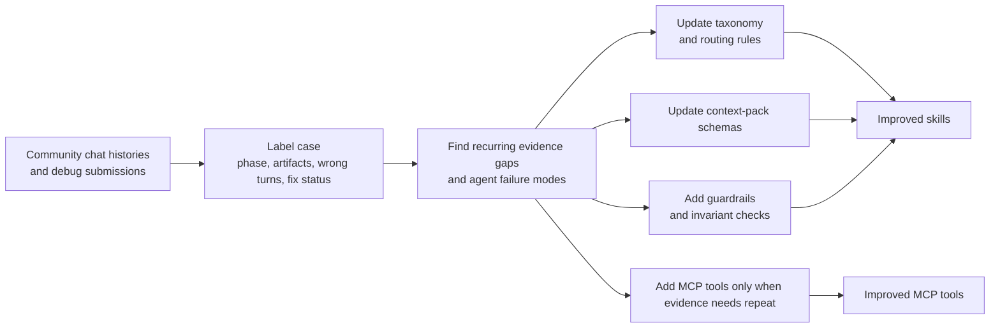

# SWMF MCP Prototype Server

A small, demoable MCP server for SWMF-oriented workflows.

## Architecture

### End-to-end MCP to SWMF flow



Current package layout:



## Intro (for those new to MCP)

If you have never used MCP before, think of this project as a safe translator between a chat assistant and SWMF workflows.

- You ask a question in plain language, like "is my PARAM.in valid?"
- The assistant calls a specific server tool (for example `swmf_validate_param`)
- The tool runs only the allowed logic and returns structured results
- You get actionable feedback without giving the assistant unrestricted shell access

What MCP means here:
- MCP (Model Context Protocol) is just the bridge that lets an AI assistant call named tools with typed inputs
- This repository implements those tools for SWMF tasks (validation, explanation, setup guidance, quickrun helpers)
- Safety is intentional: narrow tool contracts instead of open-ended command execution

### Why not rely on code indexing alone?

Code indexing is enough for many read-only questions, such as explaining `PARAM.XML`, `Config.pl`, or example inputs.

MCP tools help when the assistant needs to work with the real SWMF environment: validate `PARAM.in`, inspect run directories, prepare builds, post-process outputs, or generate IDL workflows. Those tasks depend on runtime state and controlled execution, which a static code index cannot provide.

In short, indexing helps the assistant **understand** SWMF, while MCP tools let it **operate** SWMF safely and predictably.

## Install

### Requirements

- Python 3.11+
- `uv` (recommended) or `pip`

### Using `uv` (recommended)

```bash
uv venv
source .venv/bin/activate
uv sync
```

### Using `pip` and `venv`

```bash
python -m venv .venv
source .venv/bin/activate
pip install -e .
```

### SWMF source link

Create a soft link to SWMF in the project root:

```bash
ln -s /path/to/SWMF SWMF
```

## Usage

Once installed and connected in MCP, you can ask natural-language questions in chat and the assistant will call SWMF tools.

Examples:
- "Validate this PARAM.in for Frontera before I waste a run. Don't try to fix."
- "Explain #COMPONENTMAP"
- "plot the beginning, intermediate and last frames of IH z=0 cut. plot func U. save them as separate images. use swmf-mcp-prototype."
- "Animate U in SC z=0 cuts with swmf-mcp-prototype and save as SC_z=0_U.mp4 video."
- "Prepare a new run for background solarwind with mrzqs1908*.fits GONG map and with AWSoM model in Run_Min folder. Use 1.0e6 for Poynting flux."

## Demos

### MCP Server Demo with 5 Prompts

Watch how the MCP server handles a variety of requests: PARAM validation, IDL workflows, build preparation, and more.

[**swmf-mcp-demo-5-prompts.mp4**](demo/swmf-mcp-demo-5-prompts.mp4)

### IDL Visualization Workflow Demo

See the IDL workflow tool in action, preparing scripts for data visualization and animation.

[**demo_idl.mp4**](demo/demo_idl.mp4)

### Resources Demo

See how SWMF-resources are used in Github Copilot to explain components.

[**demo_resources.mp4**](demo/demo_resources.mp4)

## VS Code MCP config

***IDL extension and MCP for VS Code is recommended. Get it from VS Code extension store.***

1. Locate your workspace folder.
2. Edit `.vscode/mcp.json`. Example MCP server config with `SWMF_ROOT`:

```json
{
	"servers": {
		"swmf-prototype": {
			"command": "/absolute/path/to/swmf-mcp-prototype/.venv/bin/python",
			"args": ["-m", "swmf_mcp_server.server"],
			"cwd": "/absolute/path/to/swmf-mcp-prototype",
			"env": {
        "SWMF_ROOT": "/absolute/path/to/SWMF",
        "SWMF_IDL_EXEC": "/absolute/path/to/idl/executable"
			}
		}
	}
}
```

### Environment Variables

The MCP server/tools currently read these environment variables:

- `SWMF_ROOT`
  - Used by SWMF root resolution when `swmf_root` tool argument is not provided.
  - Expected value: absolute path to an SWMF source tree containing `Config.pl`, `PARAM.XML`, and `Scripts/TestParam.pl`.

- `SWMF_IDL_EXEC`
  - Used by `swmf_run_idl_batch` as the highest-priority IDL executable/command override.
  - Resolution order in `swmf_run_idl_batch` is: `SWMF_IDL_EXEC` -> `idl_command` argument -> default `idl`.
  - Expected value: absolute executable path or a shell command resolvable in the selected shell.

- `SHELL`
  - Used by `swmf_run_idl_batch` to infer the shell when the `shell` argument is omitted.
  - Default fallback is `/bin/sh` if `SHELL` is unset.

3. Click on "Start" to start SWMF MCP server.


4. Now open Github Copilot and chat. You shall see `swmf-prototype` in `Configure Tools..` menu.

## MCP walkthrough (IDL plotting example)

Prompt used:

```text
plot the beginning, intermediate and last frames of IH z=0 cut. plot func U. save them as separate images. use swmf-mcp-prototype.
```

How the assistant handled this request:

1. It first loaded the required ENVI/IDL instruction files so the workflow followed the expected local visualization setup.
2. It checked SWMF configuration and indexed IDL procedures to understand the available plotting environment.
3. It inspected the available IH `z=0` cut output files in the run directory.
4. It identified the first, middle, and last frames from the matching file series.
5. It tried the higher-level IDL workflow generator first.
6. When that did not preserve the requested three-frame subset, it fell back to lower-level IDL procedure inspection and an explicit batch script.
7. It ran the batch script through the MCP IDL runner and generated three separate PNG images.
8. It verified that the output files existed before reporting success.

Representative tool and command sequence:

* `swmf_show_config`
* `swmf_list_idl_procedures`
* shell commands to locate and count matching `IH/z=0_var_3_t*_n*.out` files
* `swmf_prepare_idl_workflow`
* `swmf_explain_idl_procedure` for `read_data`, `plot_data`, and `show_data`
* shell inspection of SWMF IDL helper procedures
* `swmf_generate_idl_script`
* `swmf_run_idl_batch`

Selected source frames:

* Begin: `IH/z=0_var_3_t00020000_n00005000.out`
* Intermediate: `IH/z=0_var_3_t00490000_n00008681.out`
* Last: `IH/z=0_var_3_t00960000_n00011548.out`

Generated image outputs:

* `IH_z0_u_begin.png`
* `IH_z0_u_middle.png`
* `IH_z0_u_last.png`

Example `swmf_run_idl_batch` call used for the final successful step:

```json
{
  "working_dir": "/Users/zkeheng/SWMFSoftware/SWMFSOLAR/Run_Max_RP_CME3/run01",
  "idl_command": "env IDL_PATH=/Users/zkeheng/SWMFSoftware/SWMF/share/IDL/General:${IDL_PATH:-} IDL_STARTUP=idlrc /Applications/NV5/idl92/bin/idl",
  "timeout_s": 300,
  "script": "set_default_values\ndoask = 0\nfunc = 'u'\nplotmode = 'contbar'\nplottitle = 'U'\nautorange = 'y'\ntransform = 'none'\n\nfilename = 'IH/z=0_var_3_t00020000_n00005000.out'\nnpict = 1\nset_device, 'IH_z0_u_begin.ps'\nshow_data\nclose_device, /png, /delete\n\nfilename = 'IH/z=0_var_3_t00490000_n00008681.out'\nnpict = 1\nset_device, 'IH_z0_u_middle.ps'\nshow_data\nclose_device, /png, /delete\n\nfilename = 'IH/z=0_var_3_t00960000_n00011548.out'\nnpict = 1\nset_device, 'IH_z0_u_last.ps'\nshow_data\nclose_device, /png, /delete\n\nexit"
}
```

Result:

The assistant completed the request using `swmf-mcp-prototype`, generated the beginning, intermediate, and last IH `z=0` plots for function `U`, and saved each frame as a separate image.

Note: the IDL run emitted non-fatal arithmetic warnings during rendering, but the workflow completed successfully and all three PNG files were produced.


### How IDL resources are exposed through MCP

This server also exposes IDL references as MCP resources:

- `swmf://idl/procedures` to list indexed IDL procedures/macros.
- `swmf://idl/{procedure}` to fetch details for one procedure.

Example resource lookups:

```text
swmf://idl/procedures
swmf://idl/animate_data
```

### What happens inside `swmf://idl/{procedure}`

Inspect a single SWMF IDL procedure, for example `swmf://idl/animate_data`.

The server resolves the SWMF source tree, looks up the requested procedure in its indexed IDL catalog, and returns a structured summary including the signature, parameters, keywords, source path, and any nearby inline documentation.

If SWMF cannot be located, or the procedure does not exist in the index, the response returns a clear error.

## Implemented MCP tools

### Configuration & Build Domain

- `swmf_show_config`
- `swmf_select_components`
- `swmf_set_grid`
- `swmf_prepare_build`
- `swmf_prepare_component_config`
- `swmf_explain_component_config_fix`
- `swmf_infer_job_layout`
- `swmf_prepare_run`
- `swmf_detect_setup_commands`
- `swmf_apply_setup_commands`

### Parameter Validation & Generation Domain

- `swmf_explain_param`
- `swmf_validate_param`
- `swmf_run_testparam`
- `swmf_validate_external_inputs`
- `swmf_generate_param_from_template`
- `swmf_diagnose_param`

### Solar Campaign Domain

- `swmf_prepare_sc_quickrun_from_magnetogram`
- `swmf_parse_solar_event_list`
- `swmf_plan_solar_campaign`

### IDL & Visualization Domain

- `swmf_prepare_idl_workflow`
- `swmf_inspect_fits_magnetogram`

### Post-processing & Restart Domain

- `swmf_postprocess`
- `swmf_manage_restart`
- `swmf_plan_restart_from_background`

### Discovery & Reference Domain

- `swmf_list_available_components`
- `swmf_find_param_command`
- `swmf_get_component_versions`
- `swmf_find_example_params`
- `swmf_trace_param_command`

### Diagnostics Domain

- `swmf_diagnose_error`

### Debug Protocol Evidence Domain

- `swmf_collect_param_context`
- `swmf_resolve_param_includes`
- `swmf_extract_component_map`
- `swmf_collect_build_context`
- `swmf_collect_run_context`
- `swmf_extract_first_error`
- `swmf_extract_stacktrace`
- `swmf_collect_source_context`
- `swmf_collect_invariant_context`
- `swmf_compare_run_artifacts`

## Implemented MCP resources

- `swmf://param-schema/{component}`
- `swmf://examples/{name}`
- `swmf://coupling-pairs`
- `swmf://idl/procedures`
- `swmf://idl/{procedure}`


-----

## Diagnostic Design: Skills + MCP for General SWMF Debugging

### Why an unguided agent struggles with SWMF debugging

The problem is not that the agent cannot read code. The problem is that it often **jumps too fast** from a plot or log message to an explanation, and then to a code change.

In the example Claude chat history:

- it misread parts of the plots,
- changed its explanation after the user corrected it,
- suggested code edits before the mechanism was fully clear,
- and the modified code later crashed.

Why this is hard in SWMF:

- **The truth is spread out.** You need plots, raw data files, source code, logs, and runtime context together.
- **The same symptom can mean different things.** A jump may be physics, indexing, coupling, restart effects, or a real bug.
- **A small patch can break hidden assumptions.** What looks like a local fix can corrupt state somewhere else.

So an unguided agent tends to:

- over-interpret partial evidence,
- mix observation with hypothesis,
- and patch too early.

That is why the skill and diagnostic tools should force a stricter order:

1. observe,
2. gather evidence,
3. compare explanations,
4. then edit code.

This project can support more than one-off fixes or recurring bug lookups.
The design goal is to make the AI assistant behave like a disciplined SWMF
investigator:

- MCP tools gather **authoritative evidence** from SWMF
- skills enforce a **debugging protocol**
- the model does the **reasoning only after context is assembled**

### Design principles: the ultimate solution for AI debugging

1. **Skills encode process, not diagnoses**
   - Skills should say what to collect, in what order, and what not to skip.
   - Skills should avoid embedding specific bug explanations unless they are used
     as examples or tests.

2. **MCP tools expose evidence primitives, not conclusions**

3. **One universal protocol, many cases**

4. **Patch only after invariant review**

### Layered architecture



### Universal debugging state machine



### Failure families

A universal skill should route problems into a small number of stable families:

- input / `PARAM.in` / schema
- build / compile / configuration
- startup / initialization
- runtime crash / stop
- hang / stall / performance
- coupling / MPI / layout
- numerical / physics anomaly
- restart / output / postprocess
- source-code change validation

### Context packs

Each failure family should map to a reusable context pack rather than a specific
old bug.



### Observation before mechanism

The skill should force a clean separation between:

- **observations**: what plots, files, logs, and source code literally show
- **candidate mechanisms**: possible explanations for those observations
- **discriminating checks**: the next cheapest tests that separate those
  candidates

This prevents the assistant from over-interpreting a plot, editing code before
checking raw files, or confusing a plotting artifact with a source-code bug.

### How to make the system easy to improve

The skill system should be modular and data-driven so it can absorb more SWMF
community chat histories over time.



A good rule is:

- add a new **skill rule** when a repeated workflow mistake appears
- add a new **context-pack field** when an important artifact is repeatedly
  missing
- add a new **MCP tool** only when the same evidence request appears across
  multiple unrelated cases
