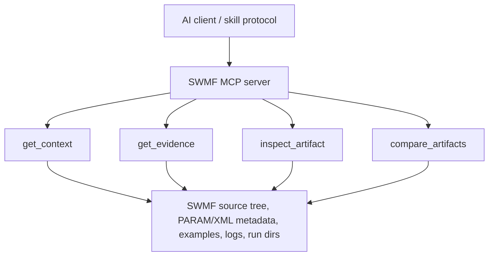

# SWMF AI

SWMF AI combines a small MCP tool surface with task-specific skills for SWMF work. The MCP tools return evidence only. Skills decide which tool to use first, what evidence matters, and how to answer. The detailed protocol lives in [`docs/skill_mcp_protocol.md`](docs/skill_mcp_protocol.md).

## System



## MCP Tools

- `get_context` for broad orientation, architecture, and cross-component questions.
- `get_evidence` for source, docs, schema, lookup, and workflow evidence.
- `inspect_artifact` for direct inspection of logs, PARAM files, XML, and run directories.
- `compare_artifacts` for deterministic diffs between two artifacts.

## Skills

Skills live in [`src/agent_assets/skills`](src/agent_assets/skills) and are the
main way the agent decides how to work.

Entry skills:

- `swmf-explain` for "how does this work?" questions.
- `swmf-configure` for setup and parameterization.
- `swmf-build` for build workflows.
- `swmf-run` for run workflows.
- `swmf-debug` for failure analysis.
- `swmf-analyze` for output interpretation and postprocessing.
- `swmf-compare` for change and difference questions.

Support skills:

- `swmf-architecture`
- `swmf-exact-lookup`
- `swmf-implementation`
- `swmf-params`
- `swmf-postproc`

The shared discipline source is
[`src/agent_assets/SWMF_CORE_DISCIPLINE.md`](src/agent_assets/SWMF_CORE_DISCIPLINE.md).

## Install & Usage

Requirements:

- Python 3.11+
- `make`
- network access the first time dependencies are resolved with `uv`

Bootstrap the local runtime and build the local knowledge index:

```bash
make
```

`make` installs `uv` if needed, reuses a valid `.venv` when possible, creates or syncs the environment when needed, warms the embedding cache, and builds the knowledge index used by the MCP server.

Install one agent bundle:

```bash
make install AGENT=claude
make install AGENT=copilot-vscode SWMF_ROOT=/data/SWMF
make install AGENT=copilot-cli SWMF_ROOT=/data/SWMF SWMFSOLAR_ROOT=/data/SWMFSOLAR
make install AGENT=codex SWMF_ROOT=/data/SWMF SWMF_IDL_EXEC=/path/to/idl
make install AGENT=claude TARGET_DIR=/path/to/workspace SWMF_ROOT=/data/SWMF
```

`AGENT` is required for `make install` and must be one of `claude`, `copilot-vscode`, `copilot-cli`, or `codex`.

`SWMF_ROOT` defaults to `./SWMF` relative to this repository. `SWMF_IDL_EXEC` is optional and is written only when passed. `SWMFSOLAR_ROOT` is optional; when omitted during `make install`, the installer auto-detects it and writes only the first existing match from:

- a sibling of the chosen `SWMF_ROOT`
- `./SWMFSOLAR` in this repository
- `TARGET_DIR/SWMFSOLAR`

`TARGET_DIR` defaults to this repository. When `TARGET_DIR` points elsewhere, `make install` also creates `TARGET_DIR/.swmf_mcp_server` as a symlink back to this repo so the generated agent config can still reference the server.

Unlike `make`, `make install` bootstraps the Python runtime if needed but does not warm the embedding cache or rebuild the knowledge index.

`make install` writes exactly one agent-specific config surface, symlinks the matching instruction file to the shared discipline source, and symlinks the agent skill tree from `src/agent_assets/skills`.

When the agent is launched in your project directory, it should be able to load MCP tools and skills automatically.

Example user prompts:

- "Explain how GM couples to IE in this setup."
- "Find evidence for how `DoCoupleGMIE` is defined and used."
- "What entrypoints matter for configuring GM?"
- "Inspect this PARAM.in and summarize likely issues."
- "Compare these two run directories and summarize meaningful changes."
