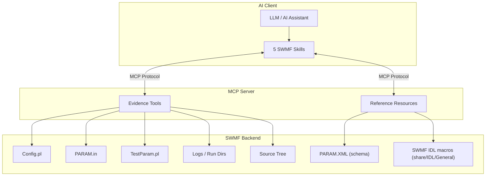
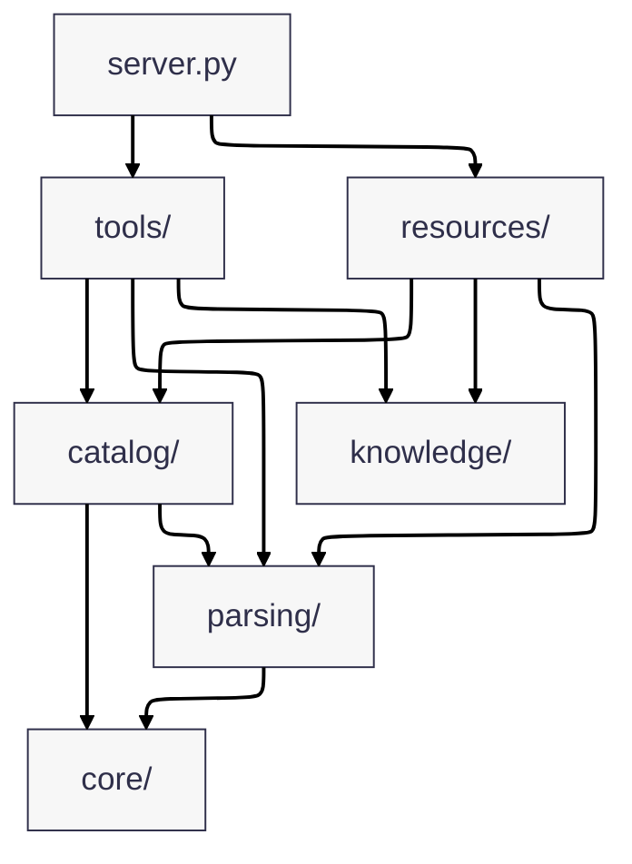
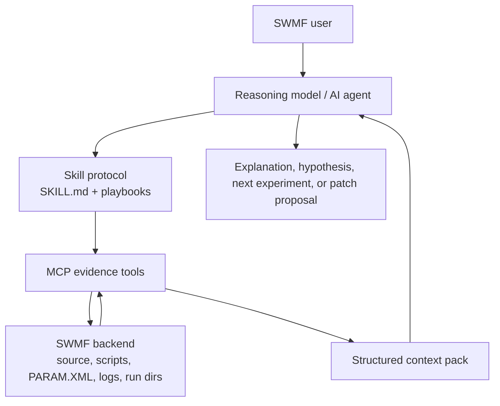
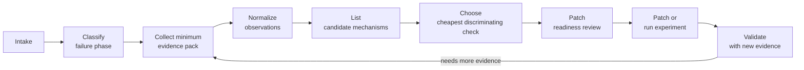
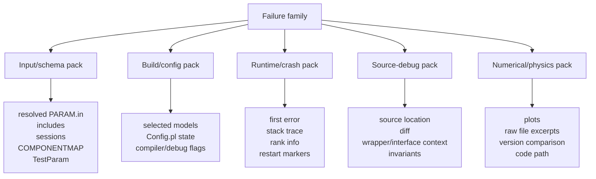
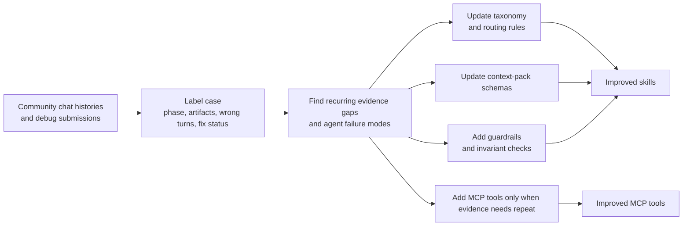

# SWMF MCP Prototype Server

A small, demoable MCP server for SWMF-oriented evidence collection and validation.

## Architecture

### End-to-end MCP to SWMF flow



Current package layout:



## Intro (for those new to MCP)

If you have never used MCP before, think of this project as a safe translator between a chat assistant and SWMF evidence sources.

- You ask a question in plain language, like "is my PARAM.in valid?"
- The assistant calls a specific server tool (for example `swmf_validate_param`)
- The tool runs only the allowed logic and returns structured results
- You get actionable feedback without giving the assistant unrestricted shell access

What MCP means here:
- MCP (Model Context Protocol) is just the bridge that lets an AI assistant call named tools with typed inputs
- This repository implements a small set of SWMF evidence tools, authoritative validators, and reference resources
- Safety is intentional: narrow tool contracts instead of open-ended command execution

### Why not rely on code indexing alone?

Code indexing is enough for many read-only questions, such as explaining `PARAM.XML`, `Config.pl`, or example inputs.

MCP tools help when the assistant needs runtime-grounded evidence: validate `PARAM.in`, inspect run directories, extract first-error context, compare artifacts, or collect focused source evidence. Those tasks depend on the live SWMF environment and controlled evidence collection, which a static code index cannot provide.

In short, indexing helps the assistant **understand** SWMF, while MCP tools let it **operate** SWMF safely and predictably.

The knowledge index is prepared automatically on the first source-search, symbol-lookup, or PARAM-evidence request. Manual use of `swmf_refresh_knowledge_index` is still available when you want to force a rebuild.

## Install

### Requirements

- Python 3.11+
- `uv` (recommended) or `pip`

### Using `uv` (recommended)

```bash
uv venv
source .venv/bin/activate
uv sync
```

### Using `pip` and `venv`

```bash
python -m venv .venv
source .venv/bin/activate
pip install -e .
```

### SWMF source link

Create a soft link to SWMF in the project root:

```bash
ln -s /path/to/SWMF SWMF
```

## Usage

Once installed and connected in MCP, you can ask natural-language questions in chat and the assistant will call SWMF tools.

For lower first-query latency on broad source-search questions, you can start the server with optional startup preindexing:

```bash
swmf-mcp-server --preindex-knowledge
```

Useful variants:

```bash
swmf-mcp-server --preindex-knowledge --swmf-root /absolute/path/to/SWMF
swmf-mcp-server --preindex-knowledge --swmfsolar-root /absolute/path/to/SWMFSOLAR
swmf-mcp-server --preindex-knowledge --force-rebuild-knowledge
```

Examples:
- "Validate this PARAM.in for Frontera before I waste a run. Don't try to fix."
- "Explain #COMPONENTMAP"
- "Compare these two run directories and tell me what changed in the output artifacts."
- "Search the SWMF source for magnetogram handling and point me to the relevant symbols."
- "Inspect the indexed IDL procedures related to plotting and tell me which ones look relevant."

## Demos

### MCP Server Demo with 5 Prompts

Watch how the MCP server handles a variety of SWMF requests across validation, evidence collection, and resource lookup.

[**swmf-mcp-demo-5-prompts.mp4**](demo/swmf-mcp-demo-5-prompts.mp4)

### IDL Visualization Workflow Demo

Legacy demo from the earlier workflow-heavy MCP surface. The current public contract keeps IDL reference resources but no longer exposes workflow-generation tools as MCP entry points.

[**demo_idl.mp4**](demo/demo_idl.mp4)

### Resources Demo

See how SWMF-resources are used in Github Copilot to explain components.

[**demo_resources.mp4**](demo/demo_resources.mp4)

## VS Code MCP config

***IDL extension and MCP for VS Code is recommended. Get it from VS Code extension store.***

1. Locate your workspace folder.
2. Edit `.vscode/mcp.json`. Example MCP server config with `SWMF_ROOT`:

```json
{
	"servers": {
		"swmf-prototype": {
			"command": "/absolute/path/to/swmf-mcp-prototype/.venv/bin/python",
			"args": ["-m", "swmf_mcp_server.server"],
			"cwd": "/absolute/path/to/swmf-mcp-prototype",
			"env": {
        "SWMF_ROOT": "/absolute/path/to/SWMF",
        "SWMF_IDL_EXEC": "/absolute/path/to/idl/executable"
			}
		}
	}
}
```

### Environment Variables

The public MCP contract currently depends on these environment variables:

- `SWMF_ROOT`
  - Used by SWMF root resolution when `swmf_root` tool argument is not provided.
  - Expected value: absolute path to an SWMF source tree containing `Config.pl`, `PARAM.XML`, and `Scripts/TestParam.pl`.

3. Click on "Start" to start SWMF MCP server.


4. Now open Github Copilot and chat. You shall see `swmf-prototype` in `Configure Tools..` menu.

## MCP walkthrough (Evidence-first example)

Prompt used:

```text
Validate this PARAM.in, resolve any include files, and tell me whether I should run TestParam.pl next.
```

How the assistant handled this request:

1. It resolved the SWMF root and checked required markers with `swmf_show_config`.
2. It parsed the PARAM content with `swmf_collect_param_context` to extract sessions and `#COMPONENTMAP` rows.
3. It resolved any `#INCLUDE` directives with `swmf_resolve_param_includes`.
4. It ran `swmf_validate_param` to get deterministic structure findings.
5. It used the result to decide whether authoritative validation with `swmf_run_testparam` was the next step.

Representative tool and command sequence:

* `swmf_show_config`
* `swmf_collect_param_context`
* `swmf_resolve_param_includes`
* `swmf_validate_param`
* `swmf_run_testparam`

Result:

The assistant assembled deterministic evidence first, separated lightweight parser findings from authoritative validation, and used `swmf_run_testparam` only as the bounded validator step.


### How IDL resources are exposed through MCP

This server also exposes IDL references as MCP resources:

- `swmf://idl/procedures` to list indexed IDL procedures/macros.
- `swmf://idl/{procedure}` to fetch details for one procedure.

Example resource lookups:

```text
swmf://idl/procedures
swmf://idl/animate_data
```

### What happens inside `swmf://idl/{procedure}`

Inspect a single SWMF IDL procedure, for example `swmf://idl/animate_data`.

The server resolves the SWMF source tree, looks up the requested procedure in its indexed IDL catalog, and returns a structured summary including the signature, parameters, keywords, source path, and any nearby inline documentation.

If SWMF cannot be located, or the procedure does not exist in the index, the response returns a clear error.

## Implemented MCP tools

### Public evidence and validator tools

- `swmf_show_config`
- `swmf_explain_param`
- `swmf_validate_param`
- `swmf_run_testparam`
- `swmf_validate_external_inputs`
- `swmf_collect_param_context`
- `swmf_resolve_param_includes`
- `swmf_extract_component_map`
- `swmf_collect_build_context`
- `swmf_collect_run_context`
- `swmf_extract_first_error`
- `swmf_extract_stacktrace`
- `swmf_collect_source_context`
- `swmf_collect_invariant_context`
- `swmf_compare_run_artifacts`
- `swmf_search_source`

`swmf_search_source`, `swmf_lookup_source_symbol`, `swmf_get_param_source_evidence`, and `swmf://knowledge/symbol/{name}` prepare the index automatically on first use.

## Implemented MCP resources

- `swmf://components`
- `swmf://component/{component}`
- `swmf://param-command/{name}`
- `swmf://param-trace/{name}`
- `swmf://param-schema/{component}`
- `swmf://examples/{name}`
- `swmf://coupling-pairs`
- `swmf://idl/procedures`
- `swmf://idl/{procedure}`
- `swmf://knowledge/symbol/{name}`
- `swmf://knowledge/index-status`


-----

## Diagnostic Design: Skills + MCP for General SWMF Debugging

### Why an unguided agent struggles with SWMF debugging

The problem is not that the agent cannot read code. The problem is that it often **jumps too fast** from a plot or log message to an explanation, and then to a code change.

In the example Claude chat history:

- it misread parts of the plots,
- changed its explanation after the user corrected it,
- suggested code edits before the mechanism was fully clear,
- and the modified code later crashed.

Why this is hard in SWMF:

- **The truth is spread out.** You need plots, raw data files, source code, logs, and runtime context together.
- **The same symptom can mean different things.** A jump may be physics, indexing, coupling, restart effects, or a real bug.
- **A small patch can break hidden assumptions.** What looks like a local fix can corrupt state somewhere else.

So an unguided agent tends to:

- over-interpret partial evidence,
- mix observation with hypothesis,
- and patch too early.

That is why the skill and diagnostic tools should force a stricter order:

1. observe,
2. gather evidence,
3. compare explanations,
4. then edit code.

This project can support more than one-off fixes or recurring bug lookups.
The design goal is to make the AI assistant behave like a disciplined SWMF
investigator:

- MCP tools gather **authoritative evidence** from SWMF
- skills enforce a **debugging protocol**
- the model does the **reasoning only after context is assembled**

### Design principles: the ultimate solution for AI debugging

1. **Skills encode process, not diagnoses**
   - Skills should say what to collect, in what order, and what not to skip.
   - Skills should avoid embedding specific bug explanations unless they are used
     as examples or tests.

2. **MCP tools expose evidence primitives, not conclusions**

3. **One universal protocol, many cases**

4. **Patch only after invariant review**

### Visible SWMF skills

The public skill layer should be exactly five visible skills:

- `swmf-param-specialist` for PARAM semantics, schema, validation, and source/schema disagreements
- `swmf-debug` for evidence-first diagnosis and patch-readiness control
- `swmf-build-run` for build/run preparation from evidence plus bounded validation
- `swmf-implementation` for source-change preparation and guarded implementation work
- `swmf-postproc` for output inspection, comparison, and visualization planning

Routing is no longer a separate visible skill. Classification, authority rules, and collaboration are embedded inside these five skills.

`SKILL.md` remains the entry point for each visible skill. When a skill needs finer request discipline, `SKILL.md` may require companion playbooks in the same skill folder, such as routing, answer-contract, or domain-specific workflow files.

### Layered architecture



### Universal debugging state machine



### Failure families

A universal skill should route problems into a small number of stable families:

- input / `PARAM.in` / schema
- build / compile / configuration
- startup / initialization
- runtime crash / stop
- hang / stall / performance
- coupling / MPI / layout
- numerical / physics anomaly
- restart / output / postprocess
- source-code change validation

### Context packs

Each failure family should map to a reusable context pack rather than a specific
old bug.



### Observation before mechanism

The skill should force a clean separation between:

- **observations**: what plots, files, logs, and source code literally show
- **candidate mechanisms**: possible explanations for those observations
- **discriminating checks**: the next cheapest tests that separate those
  candidates

This prevents the assistant from over-interpreting a plot, editing code before
checking raw files, or confusing a plotting artifact with a source-code bug.

### How to make the system easy to improve

The skill system should be modular and data-driven so it can absorb more SWMF
community chat histories over time.



A good rule is:

- add a new **skill rule** when a repeated workflow mistake appears
- add a new **context-pack field** when an important artifact is repeatedly
  missing
- add a new **MCP tool** only when the same evidence request appears across
  multiple unrelated cases
