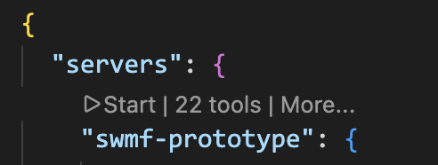

# SWMF MCP Prototype Server

A small, demoable MCP server for SWMF-oriented workflows.

## Intro (for friends new to MCP)

If you have never used MCP before, think of this project as a safe translator between a chat assistant and SWMF workflows.

- You ask a question in plain language, like "is my PARAM.in valid?"
- The assistant calls a specific server tool (for example `swmf_validate_param`)
- The tool runs only the allowed logic and returns structured results
- You get actionable feedback without giving the assistant unrestricted shell access

What MCP means here:
- MCP (Model Context Protocol) is just the bridge that lets an AI assistant call named tools with typed inputs
- This repository implements those tools for SWMF tasks (validation, explanation, setup guidance, quickrun helpers)
- Safety is intentional: narrow tool contracts instead of open-ended command execution

In short: this server makes SWMF support feel conversational while keeping behavior explicit, inspectable, and safer for demos.

This prototype is intentionally narrow and safe:
- no arbitrary shell execution
- no arbitrary file writes
- no repo-wide re-indexing
- focused on SWMF-specific read / validate / suggest workflows
## Requirements

- Python 3.11+
- `uv` (recommended) or `pip`

## Install

### Using `uv` (recommended)

```bash
uv venv
source .venv/bin/activate
uv sync
```

### Using `pip` and `venv`

```bash
python -m venv .venv
source .venv/bin/activate
pip install -e .
```

### SWMF source link

Create a soft link to SWMF in the project root:

```bash
ln -s /path/to/SWMF SWMF
```

## Usage

Once installed and connected in MCP, you can ask natural-language questions in chat and the assistant will call SWMF tools.

Examples:
- "Validate this PARAM.in for Frontera before I waste a run. Don't try to fix."
- "Explain #COMPONENTMAP"
- "plot the beginning, intermediate and last frames of IH z=0 cut. plot func U. save them as separate images. use swmf-mcp-prototype."
- "Animate U in SC z=0 cuts with swmf-mcp-prototype and save as SC_z=0_U.mp4 video."
- "Prepare a new run for background solarwind with mrzqs1908*.fits GONG map and with AWSoM model in Run_Min folder. Use 1.0e6 for Poynting flux."

## VS Code MCP config

1. Locate your workspace folder.
2. Edit `.vscode/mcp.json`.

Example MCP server config with `swmf_root`:

```json
{
	"servers": {
		"swmf-prototype": {
			"command": "python",
			"args": ["-m", "swmf_mcp_server.server"],
			"cwd": "/absolute/path/to/swmf-mcp-prototype",
			"env": {
				"swmf_root": "/absolute/path/to/SWMF"
			}
		}
	}
}
```

**IDL extension and MCP for VS Code is recommended.**

Click on "Start" to start SWMF MCP server.


## Implemented tools:
- `swmf_validate_param`
- `swmf_run_testparam`
- `swmf_detect_setup_commands`
- `swmf_apply_setup_commands`
- `swmf_infer_job_layout`
- `swmf_explain_param`
- `swmf_prepare_build`
- `swmf_prepare_run`
- `swmf_prepare_idl_workflow`
- `swmf_prepare_component_config`
- `swmf_explain_component_config_fix`
- `swmf_inspect_fits_magnetogram`
- `swmf_prepare_sc_quickrun_from_magnetogram`
- `swmf_validate_external_inputs`
- `swmf_generate_param_from_template`
- `swmf_list_tool_capabilities`
- `swmf_list_available_components`
- `swmf_find_param_command`
- `swmf_get_component_versions`
- `swmf_find_example_params`
- `swmf_trace_param_command`
- `swmf_diagnose_param`

## Fast Diagnosis Path

`swmf_diagnose_param` is a diagnosis-first, one-call workflow designed for troubleshooting speed.

Pipeline stages:
- Stage 1: resolve SWMF root, run directory, and PARAM input once.
- Stage 2: run cheap preflight checks (external references + lightweight PARAM parser checks + required component inference).
- Stage 3: run authoritative `Scripts/TestParam.pl` whenever possible.
- Stage 4: synthesize likely root cause, fastest likely fix, and recommended commands.

Returned diagnosis payload includes:
- `summary`
- `root_causes`
- `fastest_likely_fix`
- `authoritative_result`
- `recommended_commands`
- `recommended_next_step`
- `authority_by_field`

Fast-path behavior:
- If `nproc` is omitted and job-layout inference fails, diagnosis falls back to `nproc=1` to still attempt authoritative validation instead of stopping early.
- If only `param_text` is provided (no `param_path`), preflight still runs, but authoritative execution is marked as not executed with an explicit reason.

Execution context rules:
- SWMF top-level helpers (for example `Scripts/TestParam.pl`, `Config.pl`) are launched with working directory at the resolved SWMF source root.
- Run-directory helpers (for example `Restart.pl`, `PostProc.pl`) can run from a run directory when that workflow expects run-local context.
- This distinction matters because `TestParam.pl` expects top-level SWMF files (for example `Config.pl`, `PARAM.XML`) relative to launch context.

Performance notes for authoritative validation:
- `swmf_run_testparam` and `swmf_diagnose_param` use a fast default `nproc=1` when `nproc` is omitted and no `job_script_path` is provided.
- Job-layout inference is only attempted when `job_script_path` is explicitly provided.
- `swmf_run_testparam` caches recent authoritative results for unchanged inputs (`swmf_root`, `param_path`, requested `nproc`) and returns `from_cache: true` on cache hits.

## Architecture (layered)

### Request Flow Diagram

```mermaid
flowchart LR
	U[User in Chat] --> A[AI Assistant]
	A -->|MCP tool call| S[SWMF MCP Server]

	S --> T[Tool Layer\n(contracts + input models)]
	T --> V[Service Layer\n(validation/explain/build/run)]

	V --> P[Parsing + Discovery + Catalog]
	P --> X[SWMF Sources\nPARAM.XML, TestParam.pl, examples]

	X --> P
	P --> V
	V --> T
	T -->|structured response| A
	A --> U

	K[Curated Knowledge\nnon-authoritative hints] --> V
```

The server is now a thin MCP adapter over explicit subsystems:

- `src/swmf_mcp_server/server.py`
	- MCP registration and request mapping only
	- no XML parsing, no template scanning, no TestParam subprocess assembly
- `src/swmf_mcp_server/core/`
	- typed models, authority/source-kind constants, config defaults, error payload helpers
- `src/swmf_mcp_server/discovery/`
	- SWMF root detection with explicit arg/env/run-dir and workspace symlink-aware heuristics
	- filesystem safety helpers and mtime utilities
- `src/swmf_mcp_server/catalog/`
	- unified source-catalog construction with mtime cache invalidation
	- XML command indexing, component/version discovery, script indexing, template/example indexing, IDL macro discovery
- `src/swmf_mcp_server/parsing/`
	- lightweight PARAM parser
	- component-map expansion checks
	- external-reference extraction
	- scheduler/job layout inference
- `src/swmf_mcp_server/services/`
	- `explain_service.py`: authoritative-first explain flow with curated enrichment
	- `retrieve_service.py`: component/version/command/example retrieval and tracing
	- `validation_service.py`: lightweight validation and unresolved-reference classification
	- `testparam_service.py`: authoritative `Scripts/TestParam.pl` execution only
	- `build_service.py`: build/config planning and component-config guidance
	- `run_service.py`: starter PARAM generation, setup command detection/execution, job-layout orchestration
	- `template_service.py`: template selection and adaptation
	- `solar_quickrun_service.py`: isolated non-authoritative solar quickrun heuristics
	- `idl_service.py`: IDL and FITS helper workflows
- `src/swmf_mcp_server/knowledge/curated.py`
	- small hand-authored summaries only (not authoritative semantics)

## Source Of Truth Policy

The server explicitly reports source provenance and authority for explain/retrieval outputs.

Source kinds used in responses include:
- `curated`
- `PARAM.XML`
- `component PARAM.XML`
- `example PARAM.in`
- `TestParam.pl`
- `manual/docs` (when applicable)

Authority levels:
- `heuristic`: convenience-only or curated fallback
- `derived`: deterministic extraction from examples/templates
- `authoritative`: direct metadata from `PARAM.XML` / component `PARAM.XML`, or TestParam execution

`swmf_explain_param` behavior:
- first queries indexed authoritative XML sources
- then enriches with curated summaries when available
- returns source paths, source kinds, defaults/ranges/allowed values when extractable

`swmf_validate_param` behavior:
- remains safe/lightweight parser mode
- distinguishes:
	- syntax/structure errors
	- inferred issues
	- unresolved external references
	- explicit `requires_authoritative_validation`
- authoritative path remains `swmf_run_testparam`

Every major explain/retrieve/validation/testparam response includes:
- `authority`
- `source_kind`
- `source_paths`
- `swmf_root_resolved`

## What Remains Heuristic

These areas are intentionally heuristic and marked in tool outputs:
- quickrun generation from magnetogram metadata
- natural-language IDL visualization request parsing
- template patching suggestions when constructing quick-run PARAM text

Authoritative validation and semantics still require:
- `Scripts/TestParam.pl`
- SWMF `PARAM.XML` definitions
- component-specific docs and real run-time checks

Path-aware inputs for run-directory workflows:
- `swmf_root` tool argument
- `SWMF_ROOT` environment variable
- `run_dir` local heuristics

## What this prototype is for

This server is meant to feel like an SWMF-aware assistant for a group demo.

It focuses on the SWMF workflow around:
- `Config.pl`
- `PARAM.in`
- `PARAM.XML`
- `Scripts/TestParam.pl`
- `make rundir`
- `Restart.pl`
- `PostProc.pl`

It does **not** replace real SWMF validation. The authoritative SWMF-side checks still come from:
- `PARAM.XML`
- `Scripts/TestParam.pl`

## SWMF root resolution

Tools that need SWMF context resolve the source tree in this order:
1. explicit `swmf_root` argument
2. `SWMF_ROOT` environment variable
3. local `run_dir` heuristics and workspace-relative symlink candidates:
	- `run_dir`
	- `run_dir.parent`
	- `run_dir.parent.parent`
	- workspace children/symlinks that resolve to SWMF marker layout

The server only accepts a candidate as SWMF root when all of these markers exist:
- `Config.pl`
- `PARAM.XML`
- `Scripts/TestParam.pl`

If resolution fails, tool responses return:
- `ok: false`
- `hard_error: true`
- a concise `message`
- `how_to_fix` guidance
- `swmf_root_resolved: null`

No unrestricted full-filesystem crawl is performed.

## Working from a separate run directory

You can call tools while your current shell/editor location is a run directory outside the SWMF source tree.

Recommended approaches:
- pass `swmf_root` explicitly in the tool call
- set `SWMF_ROOT` once in MCP server environment
- pass `run_dir` so local parent checks can resolve SWMF safely

For `swmf_validate_param`:
- provide `param_text` directly, or
- provide `param_path`
- if both are provided, `param_text` is used
- relative `param_path` resolves relative to `run_dir` when provided, otherwise current working directory
- this tool is lightweight parser-only and does not run `TestParam.pl`
- for authoritative SWMF validation, use `swmf_run_testparam`

## IDL workflow prepare tools

`swmf_prepare_idl_workflow` is a safe, demo-focused planner for SWMF IDL macro workflows covered by the IDL manual.

Deterministic calling contract:
- provide `task` when possible (recommended for agents)
- `request` is optional helper text
- at least one of `task` or `request` is required

Supported workflow families:
- read snapshots (`read_data`, `show_data`)
- plot fields (`plot_data`, common `plotmode` values)
- animate output files (`animate_data`, movie options)
- export plots/animations in requested format (`output_format`) and artifact namespace (`artifact_name`)
- transform grids (`transform` with regular/polar/unpolar/sphere heuristics)
- compare datasets (`compare`, optional difference plotting)
- read and plot logs (`read_log_data`, `plot_log_data`)

Generic output controls for both IDL tools:
- `output_format`: `none`, `png`, `jpeg`, `bmp`, `tiff`, `ps`, `mp4`, `mov`, `avi`
- `artifact_name`: output namespace or basename
- `preview`: whether to show interactive animation when supported
- `frame_indices`: optional explicit frame index list for animation sampling

Animation/movie optimization in the generic tool:
- when `output_format` is `mp4`, `mov`, or `avi`, generated IDL uses `videofile` and `videorate`
- when `output_format` is image-based (`png`, `jpeg`, `bmp`, `tiff`, `ps`), generated IDL uses `moviedir`

Important plot export note:
- For `task='plot'`, SWMF IDL `set_device` writes PostScript output.
- Non-PS image outputs for plot workflows are produced by converting the generated `.ps` file (the tool returns example conversion commands).

For machine introspection and robust agent planning, use:
- `swmf_list_tool_capabilities`

What it does:
- parses a narrow natural-language request (variable, cut plane, movie format)
- suggests shell commands to combine output files into one `.outs`
- returns an IDL script text that calls `animate_data` and saves MP4
- suggests an execution sequence

What it does not do:
- does not execute shell commands
- does not create files

Example request:
- please visualize and animate U in SC z=0 cuts and save as mp4 video

Typical prepared shell commands:
- `cd /path/to/run_or_output_dir`
- `cat *z=0*.out > z=0.outs`
- `IDL_PATH="/path/to/SWMF/share/IDL/General:${IDL_PATH:-}" IDL_STARTUP=idlrc idl < animate_z0_u_animation.pro`

Example returned IDL script text:

```idl
filename='z=0.outs'
func='u'
plotmode='contbar'
plottitle='U in SC z=0 cut'
savemovie='mp4'
videofile='z0_u_animation'
videorate=10
showmovie='n'
animate_data
```

Notes:
- the tool assumes you run IDL from the directory that contains output files
- if SWMF root cannot be resolved, the tool still prepares output but warns that `IDL_PATH` may need manual setup
- patterns for combining files are heuristic and may need manual adjustment for your run

## Fixing missing component versions

Validation can fail when `PARAM.in` references real components (for example `SC`) but the SWMF build only includes `Empty` component versions.

Use `swmf_prepare_component_config` to infer required components from `PARAM.in` (`#COMPONENTMAP`, `#BEGIN_COMP`, and `#COMPONENT` sections) and return a safe `Config.pl` suggestion.

Example:
- PARAM.in requires `SC`
- tool returns `./Config.pl -v=Empty,SC/BATSRUS`
- then rebuild with `make clean` and `make -j`

Deterministic workflow:
- run `swmf_validate_param` for lightweight structure checks only
- run `swmf_run_testparam` for authoritative SWMF validation
- if `swmf_run_testparam` detects likely missing compiled component versions, it returns `component_config_hint` from `swmf_prepare_component_config`

`swmf_run_testparam` returns:
- `swmf_root_resolved`
- `exit_code`, `stdout`, `stderr`
- `raw_testparam_output`
- `quick_interpretation`
- `likely_missing_component_versions`
- no automatic remediation actions unless explicitly requested in a later tool call

Safety:
- these tools do not execute `Config.pl`
- these tools do not modify files
- no generic shell fallback is used outside MCP server tools

## Detecting setup commands in PARAM.in

`swmf_detect_setup_commands` scans PARAM text for embedded setup/build commands and only accepts a strict whitelist.

Allowed commands:
- `Config.pl ...`
- `./Config.pl ...`
- `make clean`
- `make -j` (or `make -jN`)

If command-like lines are present but rejected (for example containing pipes or redirection), they are returned in `rejected_candidates` with reasons.

`swmf_validate_param` remains lightweight, but now reports:
- `setup_commands_detected`
- `detected_setup_commands`
- `recommended_next_tool` (typically `swmf_apply_setup_commands` when commands are found)

## Applying setup commands safely

`swmf_apply_setup_commands` can execute setup commands explicitly.

Safety behavior:
- never auto-runs from `swmf_validate_param`
- executes only whitelisted commands
- runs only in `swmf_root_resolved`
- no shell pipelines
- no redirects
- no background jobs
- no arbitrary command execution

Execution output includes per-command:
- normalized command
- argv
- cwd
- exit code
- stdout/stderr

## Inferring nproc from job scripts

`swmf_infer_job_layout` reads a job script either from `job_script_path` or by searching `run_dir` for likely scripts (`job.*`, `*.slurm`, `*.sbatch`, or files containing `#SBATCH`).

It extracts/infers:
- `scheduler`
- `machine_hint` (for example `job.fontera` -> `fontera`)
- `nodes`
- `tasks_per_node`
- `ntasks_total`
- launch entries from `ibrun`
- `swmf_rank_offset`
- `swmf_nproc`

`swmf_run_testparam` and `swmf_prepare_run` now support omitting `nproc`; they attempt job-script inference and report the source.

### Example: job.fontera

Given:
- `#SBATCH -N 30`
- `#SBATCH --tasks-per-node 56`
- `ibrun -n 1 ./PostProc.pl ...`
- `ibrun -o 56 -n $(( (SLURM_NNODES - 1 ) *56 )) ./SWMF.exe ...`

Expected inferred values:
- total allocated ranks: `1680`
- postproc detected: true
- SWMF rank offset: `56`
- SWMF rank count: `1624`

## Solar quickrun from GONG FITS

The prototype includes deterministic, safety-focused tools to support a quick workflow:

1. inspect FITS metadata (`swmf_inspect_fits_magnetogram`)
2. prepare heuristic SC quickrun suggestions (`swmf_prepare_sc_quickrun_from_magnetogram`)
3. verify external file references (`swmf_validate_external_inputs`)
4. run parser validation (`swmf_validate_param`)
5. run authoritative SWMF validation (`swmf_run_testparam`)

### Safety model for this workflow

- no arbitrary shell execution
- no automatic `Config.pl` or `make` execution
- no automatic `PARAM.in` writes
- return structured suggestions and explicit warnings

### Tool schemas (new)

`swmf_inspect_fits_magnetogram`

Input:

```json
{
	"fits_path": "string",
	"run_dir": "string | null",
	"swmf_root": "string | null",
	"read_data": "boolean"
}
```

Output (stable fields):

```json
{
	"ok": true,
	"message": "FITS metadata inspection completed.",
	"fits_path_resolved": "/abs/path/map.fits",
	"instrument": "GONG",
	"source": "NSO",
	"observation_date": "2026-03-10T00:00:00",
	"map_date": "2026-03-11T00:00:00",
	"carrington_rotation": "2311",
	"dimensions": {"naxis": 2, "naxis1": 3600.0, "naxis2": 1440.0},
	"coordinate_system_hints": {"ctype1": "CRLN-CEA", "ctype2": "CRLT-CEA"},
	"probable_map_type": "synoptic",
	"warnings": [],
	"suggested_next_tool": "swmf_prepare_sc_quickrun_from_magnetogram"
}
```

`swmf_prepare_sc_quickrun_from_magnetogram`

Input:

```json
{
	"fits_path": "string",
	"run_dir": "string | null",
	"swmf_root": "string | null",
	"mode": "sc_steady | sc_ih_steady | sc_ih_timeaccurate",
	"nproc": "integer | null",
	"job_script_path": "string | null"
}
```

Output (stable fields):

```json
{
	"ok": true,
	"heuristic": true,
	"swmf_root_resolved": "/abs/path/SWMF",
	"recommended_components": ["SC/BATSRUS", "IH/BATSRUS"],
	"recommended_config_pl_command": "./Config.pl -v=Empty,SC/BATSRUS,IH/BATSRUS",
	"recommended_build_steps": ["./Config.pl -install", "Config.pl -v=Empty,SC/BATSRUS,IH/BATSRUS", "Config.pl -nodebug -O4", "Config.pl -show", "make -j"],
	"recommended_run_steps": ["make rundir", "mv run quick_sc_ih_steady", "Scripts/TestParam.pl -n=64 quick_sc_ih_steady/PARAM.in", "cd quick_sc_ih_steady"],
	"inferred_nproc": 64,
	"inferred_nproc_source": "job_script_inference",
	"suggested_param_template_text": "...",
	"suggested_param_patch_summary": ["..."],
	"solar_alignment_hints": ["..."],
	"external_input_warnings": ["..."],
	"validation_plan": ["..."],
	"recommended_next_tool": "swmf_validate_external_inputs"
}
```

`swmf_validate_external_inputs`

Input:

```json
{
	"param_text": "string | null",
	"param_path": "string | null",
	"run_dir": "string | null",
	"swmf_root": "string | null"
}
```

Output (stable fields):

```json
{
	"ok": false,
	"missing_files": ["/abs/path/missing_gong.fits"],
	"existing_files": ["/abs/path/RESTART.in"],
	"ambiguous_references": ["$MAG_INPUT"],
	"warnings": ["Solar external input reference detected: gong_synoptic.fits. Confirm coordinate alignment and date/rotation consistency."],
	"suggested_next_tool": "swmf_validate_param"
}
```

`swmf_generate_param_from_template` (optional helper)

Input:

```json
{
	"template_kind": "solar_sc | solar_sc_ih",
	"fits_path": "string | null",
	"run_dir": "string | null",
	"swmf_root": "string | null",
	"nproc": "integer | null"
}
```

Output fields:

```json
{
	"ok": true,
	"template_found": true,
	"template_source": "/abs/path/template/PARAM_SC.in",
	"heuristic": true,
	"suggested_param_text": "...",
	"suggested_param_patch_summary": ["..."]
}
```

### Example: SC-only run from GONG FITS

Request:

```json
{
	"tool": "swmf_prepare_sc_quickrun_from_magnetogram",
	"arguments": {
		"fits_path": "input/gong_synoptic.fits",
		"run_dir": "/path/to/run_demo",
		"swmf_root": "/path/to/SWMF",
		"mode": "sc_steady"
	}
}
```

Typical highlights in result:
- recommended components include `SC/BATSRUS`
- output marked `heuristic: true`
- includes suggested `PARAM` template text and validation plan

### Example: SC+IH run from GONG FITS

Request:

```json
{
	"tool": "swmf_prepare_sc_quickrun_from_magnetogram",
	"arguments": {
		"fits_path": "input/gong_synoptic.fits",
		"run_dir": "/path/to/run_demo",
		"swmf_root": "/path/to/SWMF",
		"mode": "sc_ih_steady",
		"job_script_path": "job.frontera"
	}
}
```

Typical highlights in result:
- recommended components include `SC/BATSRUS` and `IH/BATSRUS`
- `inferred_nproc_source` can be `job_script_inference`
- returns `solar_alignment_hints` and `external_input_warnings`

### Heuristic vs authoritative checks

Heuristic outputs:
- FITS map classification (`probable_map_type`)
- quickrun component/layout suggestions
- suggested PARAM template/patch text

Authoritative outputs:
- SWMF parser and semantic checks from `Scripts/TestParam.pl` via `swmf_run_testparam`
