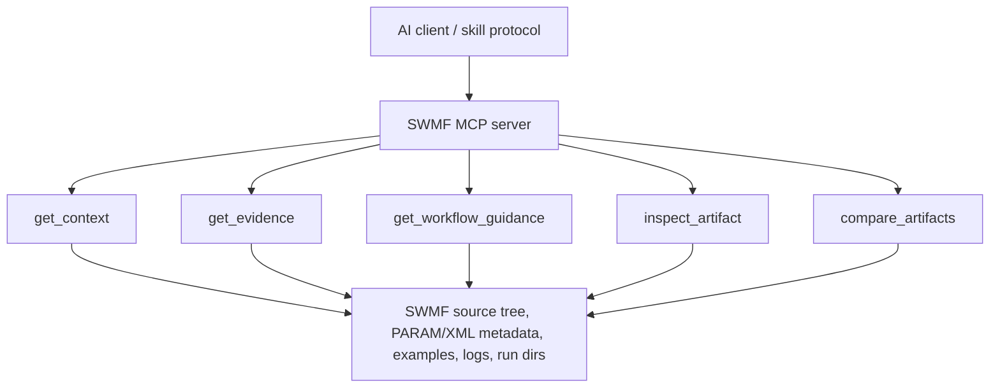

# SWMF MCP Prototype Server

A focused MCP server for SWMF evidence collection. The public contract is v2-only:
five named tools, no MCP resources, and no legacy helper-tool aliases.

## Public Tools

- `get_context` - orient broad architecture, coupling, debug, lookup, workflow, or comparison questions.
- `get_evidence` - retrieve grounded local evidence from source, PARAM/XML metadata, examples, docs, catalog, or semantic index.
- `get_workflow_guidance` - find likely configuration, build, run, or analysis entrypoints without executing them.
- `inspect_artifact` - inspect logs, PARAM files, XML files, run directories, build output, or result files.
- `compare_artifacts` - compare two PARAM files, logs, run directories, or generic files.

All lower-level parser, catalog, reference, and knowledge code is private
implementation infrastructure behind these tools.

## Architecture



## Install

### Requirements

- Python 3.11+
- `uv` recommended, or `pip`

### Using `uv`

```bash
uv venv
source .venv/bin/activate
uv sync
```

### Using `pip`

```bash
python -m venv .venv
source .venv/bin/activate
pip install -e .
```

### SWMF Source Root

Set `SWMF_ROOT` to an absolute SWMF checkout path, or pass `swmf_root` in tool
arguments when calling tools.

```bash
export SWMF_ROOT=/absolute/path/to/SWMF
```

The root should contain normal SWMF markers such as `Config.pl`, `PARAM.XML`,
and `Scripts/TestParam.pl`.

## Usage

Run the server over stdio:

```bash
python -m swmf_mcp_server.server
```

Optional startup preindexing reduces latency for broad evidence searches:

```bash
swmf-mcp-server --preindex-knowledge
swmf-mcp-server --preindex-knowledge --swmf-root /absolute/path/to/SWMF
swmf-mcp-server --preindex-knowledge --force-rebuild-knowledge
```

Example user requests:

- "Explain how GM couples to IE in this setup."
- "Find evidence for how `DoCoupleGMIE` is defined and used."
- "What entrypoints matter for configuring GM?"
- "Inspect this PARAM.in and summarize likely issues."
- "Compare these two run directories and summarize meaningful changes."

## VS Code MCP Config

Example `.vscode/mcp.json`:

```json
{
  "servers": {
    "swmf-prototype": {
      "command": "/absolute/path/to/swmf-mcp-prototype/.venv/bin/python",
      "args": ["-m", "swmf_mcp_server.server"],
      "cwd": "/absolute/path/to/swmf-mcp-prototype",
      "env": {
        "SWMF_ROOT": "/absolute/path/to/SWMF",
        "SWMF_IDL_EXEC": "/absolute/path/to/idl/executable"
      }
    }
  }
}
```

## Tool Selection Pattern

The repository skills decide which tool to call first:

- Broad architecture or coupling question: start with `get_context`.
- Exact source, parameter, IDL, or example lookup: start with `get_evidence`.
- Configuration, build, run, or analysis workflow: start with `get_workflow_guidance`.
- Local log, PARAM, XML, run directory, build output, or result file: start with `inspect_artifact`.
- Two artifacts or run outputs: start with `compare_artifacts`.

The tools gather evidence. The assistant remains responsible for reasoning,
answering, proposing next checks, or making code changes.
