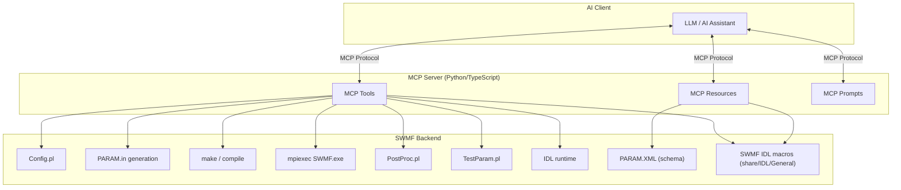
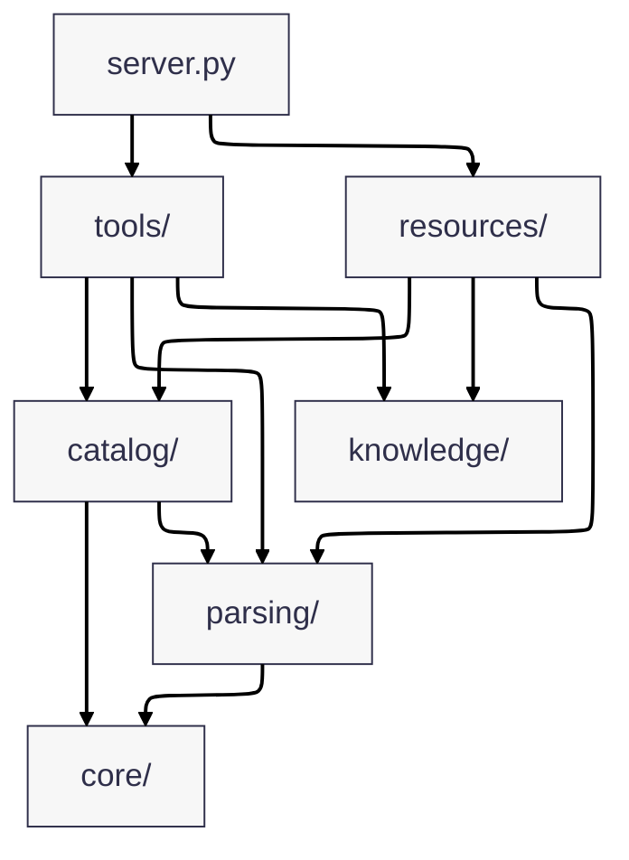

# SWMF MCP Prototype Server

A small, demoable MCP server for SWMF-oriented workflows.

## Architecture

### End-to-end MCP to SWMF flow



Current package layout:



- `src/swmf_mcp_server/server.py`
  - Registers all tool and resource domains and exposes convenience exports for integration tests and scripts.
- `src/swmf_mcp_server/core/`
  - Shared config, models, authority constants, error payloads, and SWMF root resolution.
- `src/swmf_mcp_server/catalog/`
  - Source indexing/runtime catalog access for commands, templates, scripts, and IDL procedures.
- `src/swmf_mcp_server/parsing/`
  - Lightweight PARAM parsing, component map parsing, XML parsing, IDL signature parsing, and external reference extraction.
- `src/swmf_mcp_server/tools/`
  - Domain-grouped MCP tool handlers (`configure`, `param`, `build_run`, `postprocess`, `retrieve`, `idl`), registered with `@mcp.tool(description="...")(swmf_...)`.
- `src/swmf_mcp_server/resources/`
  - MCP resource handlers for schema, examples, coupling info, and IDL reference views, registered with `@mcp.resource("swmf://...")`.
- `src/swmf_mcp_server/knowledge/`
  - Curated fallback knowledge used as non-authoritative enrichment when catalog fails.

## Intro (for those new to MCP)

If you have never used MCP before, think of this project as a safe translator between a chat assistant and SWMF workflows.

- You ask a question in plain language, like "is my PARAM.in valid?"
- The assistant calls a specific server tool (for example `swmf_validate_param`)
- The tool runs only the allowed logic and returns structured results
- You get actionable feedback without giving the assistant unrestricted shell access

What MCP means here:
- MCP (Model Context Protocol) is just the bridge that lets an AI assistant call named tools with typed inputs
- This repository implements those tools for SWMF tasks (validation, explanation, setup guidance, quickrun helpers)
- Safety is intentional: narrow tool contracts instead of open-ended command execution

In short: this server makes SWMF support feel conversational while keeping behavior explicit, inspectable, and safer for demos.

This prototype is intentionally narrow and safe:
- no arbitrary shell execution
- no arbitrary file writes
- no repo-wide re-indexing
- focused on SWMF-specific read / validate / suggest workflows

Here is a README-friendly version you can drop in as an “advantage” section.

### Why MCP tools help when code indexing already exists

Code indexing is already very useful for SWMF.

A good assistant can read `PARAM.XML`, `Config.pl`, example `PARAM.in` files, and source code to explain commands, summarize coupling logic, or suggest likely configuration snippets. For read-only questions about the repository, that is often enough.

MCP tools add value in a different place: **operating SWMF, not just reading it**.

They let the assistant work with live SWMF state and controlled execution steps that do not exist in a static index. That includes validating a real `PARAM.in` with `Scripts/TestParam.pl`, checking the current configuration, preparing builds, inspecting run directories, post-processing outputs, and generating IDL workflows. In these cases, the assistant is no longer guessing from examples; it can return results based on the actual environment and current files.

This also makes the workflow more reliable. Instead of only generating text that looks plausible, the assistant can follow a closed loop such as: prepare input, validate it, report errors, suggest fixes, and re-check. That is especially useful for SWMF tasks where correctness depends on the current setup, compiled components, or files produced during a run.

Another benefit is safety. MCP tools expose narrow, explicit operations instead of unrestricted shell access. That keeps demo behavior more predictable, makes actions easier to inspect, and leaves room for guardrails around validation, file access, and run preparation.

In practice, the split is simple:

- **Code indexing** is best for understanding SWMF source code and configuration structure.
- **MCP tools** are best for executing SWMF workflows and inspecting runtime state.

The two approaches complement each other well: indexing helps the assistant understand SWMF, while MCP tools let it act on SWMF in a controlled way.

Here is an even shorter version if you want something tighter:

### Why not rely on code indexing alone?

Code indexing is enough for many read-only questions, such as explaining `PARAM.XML`, `Config.pl`, or example inputs.

MCP tools help when the assistant needs to work with the real SWMF environment: validate `PARAM.in`, inspect run directories, prepare builds, post-process outputs, or generate IDL workflows. Those tasks depend on runtime state and controlled execution, which a static code index cannot provide.

In short, indexing helps the assistant **understand** SWMF, while MCP tools let it **operate** SWMF safely and predictably.

## Install

### Requirements

- Python 3.11+
- `uv` (recommended) or `pip`

### Using `uv` (recommended)

```bash
uv venv
source .venv/bin/activate
uv sync
```

### Using `pip` and `venv`

```bash
python -m venv .venv
source .venv/bin/activate
pip install -e .
```

### SWMF source link

Create a soft link to SWMF in the project root:

```bash
ln -s /path/to/SWMF SWMF
```

## Usage

Once installed and connected in MCP, you can ask natural-language questions in chat and the assistant will call SWMF tools.

Examples:
- "Validate this PARAM.in for Frontera before I waste a run. Don't try to fix."
- "Explain #COMPONENTMAP"
- "plot the beginning, intermediate and last frames of IH z=0 cut. plot func U. save them as separate images. use swmf-mcp-prototype."
- "Animate U in SC z=0 cuts with swmf-mcp-prototype and save as SC_z=0_U.mp4 video."
- "Prepare a new run for background solarwind with mrzqs1908*.fits GONG map and with AWSoM model in Run_Min folder. Use 1.0e6 for Poynting flux."

## Demos

### MCP Server Demo with 5 Prompts

Watch how the MCP server handles a variety of requests: PARAM validation, IDL workflows, build preparation, and more.

[**swmf-mcp-demo-5-prompts.mp4**](demo/swmf-mcp-demo-5-prompts.mp4)

### IDL Visualization Workflow Demo

See the IDL workflow tool in action, preparing scripts for data visualization and animation.

[**demo_idl.mp4**](demo/demo_idl.mp4)

### Resources Demo

See how SWMF-resources are used in Github Copilot to explain components.

[**demo_resources.mp4**](demo/demo_resources.mp4)

## VS Code MCP config

***IDL extension and MCP for VS Code is recommended. Get it from VS Code extension store.***

1. Locate your workspace folder.
2. Edit `.vscode/mcp.json`. Example MCP server config with `SWMF_ROOT`:

```json
{
	"servers": {
		"swmf-prototype": {
			"command": "/absolute/path/to/swmf-mcp-prototype/.venv/bin/python",
			"args": ["-m", "swmf_mcp_server.server"],
			"cwd": "/absolute/path/to/swmf-mcp-prototype",
			"env": {
        "SWMF_ROOT": "/absolute/path/to/SWMF",
        "SWMF_IDL_EXEC": "/absolute/path/to/idl/executable"
			}
		}
	}
}
```

### Environment Variables

The MCP server/tools currently read these environment variables:

- `SWMF_ROOT`
  - Used by SWMF root resolution when `swmf_root` tool argument is not provided.
  - Expected value: absolute path to an SWMF source tree containing `Config.pl`, `PARAM.XML`, and `Scripts/TestParam.pl`.

- `SWMF_IDL_EXEC`
  - Used by `swmf_run_idl_batch` as the highest-priority IDL executable/command override.
  - Resolution order in `swmf_run_idl_batch` is: `SWMF_IDL_EXEC` -> `idl_command` argument -> default `idl`.
  - Expected value: absolute executable path or a shell command resolvable in the selected shell.

- `SHELL`
  - Used by `swmf_run_idl_batch` to infer the shell when the `shell` argument is omitted.
  - Default fallback is `/bin/sh` if `SHELL` is unset.

3. Click on "Start" to start SWMF MCP server.


4. Now open Github Copilot and chat. You shall see `swmf-prototype` in `Configure Tools..` menu.

## MCP walkthrough (IDL plotting example)

Prompt used:

```text
plot the beginning, intermediate and last frames of IH z=0 cut. plot func U. save them as separate images. use swmf-mcp-prototype.
```

How the assistant handled this request:

1. It first loaded the required ENVI/IDL instruction files so the workflow followed the expected local visualization setup.
2. It checked SWMF configuration and indexed IDL procedures to understand the available plotting environment.
3. It inspected the available IH `z=0` cut output files in the run directory.
4. It identified the first, middle, and last frames from the matching file series.
5. It tried the higher-level IDL workflow generator first.
6. When that did not preserve the requested three-frame subset, it fell back to lower-level IDL procedure inspection and an explicit batch script.
7. It ran the batch script through the MCP IDL runner and generated three separate PNG images.
8. It verified that the output files existed before reporting success.

Representative tool and command sequence:

* `swmf_show_config`
* `swmf_list_idl_procedures`
* shell commands to locate and count matching `IH/z=0_var_3_t*_n*.out` files
* `swmf_prepare_idl_workflow`
* `swmf_explain_idl_procedure` for `read_data`, `plot_data`, and `show_data`
* shell inspection of SWMF IDL helper procedures
* `swmf_generate_idl_script`
* `swmf_run_idl_batch`

Selected source frames:

* Begin: `IH/z=0_var_3_t00020000_n00005000.out`
* Intermediate: `IH/z=0_var_3_t00490000_n00008681.out`
* Last: `IH/z=0_var_3_t00960000_n00011548.out`

Generated image outputs:

* `IH_z0_u_begin.png`
* `IH_z0_u_middle.png`
* `IH_z0_u_last.png`

Example `swmf_run_idl_batch` call used for the final successful step:

```json
{
  "working_dir": "/Users/zkeheng/SWMFSoftware/SWMFSOLAR/Run_Max_RP_CME3/run01",
  "idl_command": "env IDL_PATH=/Users/zkeheng/SWMFSoftware/SWMF/share/IDL/General:${IDL_PATH:-} IDL_STARTUP=idlrc /Applications/NV5/idl92/bin/idl",
  "timeout_s": 300,
  "script": "set_default_values\ndoask = 0\nfunc = 'u'\nplotmode = 'contbar'\nplottitle = 'U'\nautorange = 'y'\ntransform = 'none'\n\nfilename = 'IH/z=0_var_3_t00020000_n00005000.out'\nnpict = 1\nset_device, 'IH_z0_u_begin.ps'\nshow_data\nclose_device, /png, /delete\n\nfilename = 'IH/z=0_var_3_t00490000_n00008681.out'\nnpict = 1\nset_device, 'IH_z0_u_middle.ps'\nshow_data\nclose_device, /png, /delete\n\nfilename = 'IH/z=0_var_3_t00960000_n00011548.out'\nnpict = 1\nset_device, 'IH_z0_u_last.ps'\nshow_data\nclose_device, /png, /delete\n\nexit"
}
```

Result:

The assistant completed the request using `swmf-mcp-prototype`, generated the beginning, intermediate, and last IH `z=0` plots for function `U`, and saved each frame as a separate image.

Note: the IDL run emitted non-fatal arithmetic warnings during rendering, but the workflow completed successfully and all three PNG files were produced.


### How IDL resources are exposed through MCP

This server also exposes IDL references as MCP resources:

- `swmf://idl/procedures` to list indexed IDL procedures/macros.
- `swmf://idl/{procedure}` to fetch details for one procedure.

Example resource lookups:

```text
swmf://idl/procedures
swmf://idl/animate_data
```

### What happens inside `swmf://idl/{procedure}`

Inspect a single SWMF IDL procedure, for example `swmf://idl/animate_data`.

The server resolves the SWMF source tree, looks up the requested procedure in its indexed IDL catalog, and returns a structured summary including the signature, parameters, keywords, source path, and any nearby inline documentation.

If SWMF cannot be located, or the procedure does not exist in the index, the response returns a clear error.

## Implemented MCP tools

### Configuration & Build Domain

- `swmf_show_config`
- `swmf_select_components`
- `swmf_set_grid`
- `swmf_prepare_build`
- `swmf_prepare_component_config`
- `swmf_explain_component_config_fix`
- `swmf_infer_job_layout`
- `swmf_prepare_run`
- `swmf_detect_setup_commands`
- `swmf_apply_setup_commands`

### Parameter Validation & Generation Domain

- `swmf_explain_param`
- `swmf_validate_param`
- `swmf_run_testparam`
- `swmf_validate_external_inputs`
- `swmf_generate_param_from_template`
- `swmf_generate_param_block`
- `swmf_diagnose_param`

### Solar Campaign Domain

- `swmf_prepare_sc_quickrun_from_magnetogram`
- `swmf_parse_solar_event_list`
- `swmf_plan_solar_campaign`

### IDL & Visualization Domain

- `swmf_prepare_idl_workflow`
- `swmf_inspect_fits_magnetogram`

### Post-processing & Restart Domain

- `swmf_postprocess`
- `swmf_manage_restart`
- `swmf_plan_restart_from_background`

### Discovery & Reference Domain

- `swmf_list_available_components`
- `swmf_find_param_command`
- `swmf_get_component_versions`
- `swmf_find_example_params`
- `swmf_trace_param_command`

### Diagnostics Domain

- `swmf_diagnose_error`

### Debug Protocol Evidence Domain

- `swmf_collect_param_context`
- `swmf_resolve_param_includes`
- `swmf_extract_component_map`
- `swmf_collect_build_context`
- `swmf_collect_run_context`
- `swmf_extract_first_error`
- `swmf_extract_stacktrace`
- `swmf_collect_source_context`
- `swmf_collect_invariant_context`
- `swmf_compare_run_artifacts`

## Implemented MCP resources

- `swmf://param-schema/{component}`
- `swmf://examples/{name}`
- `swmf://coupling-pairs`
- `swmf://idl/procedures`
- `swmf://idl/{procedure}`

## Solar Campaign Workflows

The MCP server supports planning and orchestrating multi-run solar campaign simulations via SWMFSOLAR integration.

### Phase 1: Solar Campaign Parsing and Planning (Implemented)

Two tools enable dry-run planning of SWMFSOLAR event-driven campaigns without execution:

- `swmf_parse_solar_event_list`: Parses SWMFSOLAR event-list files into normalized campaign specifications
  - Extracts selected run IDs with optional override
  - Normalizes parameter mutations (add/rm/replace/change semantics)
  - Infers realization counts by map family (ADAPT→12, GONG→1, etc.)
  - Returns structured campaign spec with model, map, and mutation metadata

- `swmf_plan_solar_campaign`: Generates dry-run campaign plans with Makefile command preview
  - Expands realizations and generates per-run simulation directories (naming: `run{id:03d}_{model}`)
  - Groups commands into compile/prepare/submit phases
  - Provides full command preview without execution
  - Detects SWMFSOLAR root and resolves paths
  - Returns `requires_manual_execution=true` for safety

Example workflow:

```text
1. Load event-list file or inline text describing solar events (CME, flare onset times, maps)
2. Call swmf_parse_solar_event_list to validate and normalize entries
3. Call swmf_plan_solar_campaign to preview compile/prepare/run commands
4. Review dry-run plan for correctness
5. (Future Phase 2) Execute the campaign with swmf_execute_solar_campaign if approved
```

## Source Of Truth Policy

The server explicitly reports source provenance and authority for explain/retrieval outputs.

Source kinds used in responses include:
- `curated`
- `PARAM.XML`
- `component PARAM.XML`
- `example PARAM.in`
- `TestParam.pl`
- `manual/docs` (when applicable)

Authority levels:
- `heuristic`: convenience-only or curated fallback
- `derived`: deterministic extraction from examples/templates
- `authoritative`: direct metadata from `PARAM.XML` / component `PARAM.XML`, or TestParam execution

`swmf_explain_param` behavior:
- first queries indexed authoritative XML sources
- then enriches with curated summaries when available
- returns source paths, source kinds, defaults/ranges/allowed values when extractable

`swmf_validate_param` behavior:
- remains safe/lightweight parser mode
- distinguishes:
	- syntax/structure errors
	- inferred issues
	- unresolved external references
	- explicit `requires_authoritative_validation`
- authoritative path remains `swmf_run_testparam`

Every major explain/retrieve/validation/testparam response includes:
- `authority`
- `source_kind`
- `source_paths`
- `swmf_root_resolved`

## What Remains Heuristic

These areas are intentionally heuristic and marked in tool outputs:
- quickrun generation from magnetogram metadata
- natural-language IDL visualization request parsing
- template patching suggestions when constructing quick-run PARAM text

Authoritative validation and semantics still require:
- `Scripts/TestParam.pl`
- SWMF `PARAM.XML` definitions
- component-specific docs and real run-time checks

Path-aware inputs for run-directory workflows:
- `swmf_root` tool argument
- `SWMF_ROOT` environment variable
- `SWMF_IDL_EXEC` environment variable (for IDL batch executable resolution)
- `run_dir` local heuristics

## What this prototype is for

This server is meant to feel like an SWMF-aware assistant for a group demo.

It focuses on the SWMF workflow around:
- `Config.pl`
- `PARAM.in`
- `PARAM.XML`
- `Scripts/TestParam.pl`
- `make rundir`
- `Restart.pl`
- `PostProc.pl`

It does **not** replace real SWMF validation. The authoritative SWMF-side checks still come from:
- `PARAM.XML`
- `Scripts/TestParam.pl`
