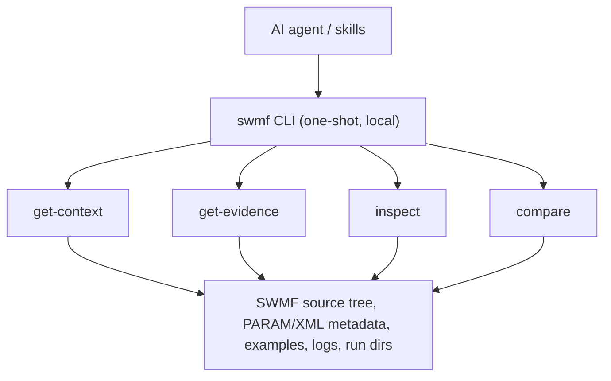

# SWMF AI

SWMF AI combines a small local CLI with task-specific skills for SWMF work. The `swmf` CLI returns evidence only. Skills decide which command to use first, what evidence matters, and how to answer. Everything runs locally — there is no server process.

## System



## CLI commands

- `swmf get-context` for broad orientation, architecture, and cross-component questions.
- `swmf get-evidence` for source, docs, schema, lookup, and workflow evidence.
- `swmf inspect` for direct inspection of logs, PARAM files, XML, and run directories.
- `swmf compare` for deterministic diffs between two artifacts.
- `swmf index build|refresh|status` to manage the local knowledge index.

Each command prints a JSON result to stdout and exits non-zero on hard errors. Run `swmf <command> --help` for the full flag set.

## Skills

Skills live in [`src/agent_assets/skills`](src/agent_assets/skills) and are the
main way the agent decides how to work.

Entry skills:

- `swmf-explain` for "how does this work?" questions.
- `swmf-configure` for setup and parameterization.
- `swmf-build` for build workflows.
- `swmf-run` for run workflows.
- `swmf-debug` for failure analysis.
- `swmf-analyze` for output interpretation and postprocessing.
- `swmf-compare` for change and difference questions.

Support skills:

- `swmf-architecture`
- `swmf-exact-lookup`
- `swmf-implementation`
- `swmf-params`
- `swmf-postproc`

The shared discipline source is
[`src/agent_assets/SWMF_CORE_DISCIPLINE.md`](src/agent_assets/SWMF_CORE_DISCIPLINE.md).

## AI-Assisted Install

If you are already inside an AI coding agent (Claude Code, GitHub Copilot, Codex CLI), copy the prompt below, fill in the two placeholders, and paste it into the agent. The agent will handle path discovery and run the right install command for you.

| Placeholder | What to put |
|---|---|
| `<AGENT>` | `claude`, `copilot-vscode`, `copilot-cli`, or `codex` |
| `<TARGET_DIR>` | Absolute path to the project directory where SWMF AI should be installed |

```
I want to install SWMF AI into <TARGET_DIR> for use with the <AGENT> agent.

The SWMF AI repository is at: <absolute path to this swmf-mcp-prototype directory>

Please complete the following steps in order:

1. Run `make` inside the swmf-mcp-prototype repository to bootstrap the Python
   runtime and build the knowledge index. Wait for it to succeed before continuing.

2. Find the SWMF source root. Check in order:
   a. The environment variable $SWMF_ROOT if set.
   b. A directory named "SWMF" that is a sibling of the swmf-mcp-prototype directory.
   c. Any other existing path named "SWMF" visible from the current machine.
   Report the resolved absolute path, or ask me if none is found.

3. Find SWMFSOLAR if it exists. Check in order:
   a. A directory named "SWMFSOLAR" that is a sibling of the SWMF root found above.
   b. A directory named "SWMFSOLAR" that is a sibling of the swmf-mcp-prototype directory.
   Report the resolved absolute path, or skip if none exists.

4. Run `which idl` to find the IDL executable. Report the path, or skip if not found.

5. Run the install command, substituting the paths discovered above:

   make install \
     AGENT=<AGENT> \
     TARGET_DIR=<TARGET_DIR> \
     SWMF_ROOT=<path from step 2> \
     [SWMF_IDL_EXEC=<path from step 4>] \
     [SWMFSOLAR_ROOT=<path from step 3>]

   Omit SWMF_IDL_EXEC and SWMFSOLAR_ROOT if those paths were not found.
```

## Install & Usage

Requirements:

- Python 3.11+
- `make`
- network access the first time dependencies are resolved with `uv`

Bootstrap the local runtime and build the local knowledge index:

```bash
make
```

`make` installs `uv` if needed, reuses a valid `.venv` when possible, creates or syncs the environment when needed, and builds the local knowledge index used by the `swmf` CLI.

Install one agent bundle:

```bash
make install AGENT=claude
make install AGENT=copilot-vscode SWMF_ROOT=/data/SWMF
make install AGENT=copilot-cli SWMF_ROOT=/data/SWMF SWMFSOLAR_ROOT=/data/SWMFSOLAR
make install AGENT=codex SWMF_ROOT=/data/SWMF SWMF_IDL_EXEC=/path/to/idl
make install AGENT=claude TARGET_DIR=/path/to/workspace SWMF_ROOT=/data/SWMF
```

`AGENT` is required for `make install` and must be one of `claude`, `copilot-vscode`, `copilot-cli`, or `codex`.

`SWMF_ROOT` defaults to `./SWMF` relative to this repository. `SWMF_IDL_EXEC` is optional and is written only when passed. `SWMFSOLAR_ROOT` is optional; when omitted during `make install`, the installer auto-detects it and writes only the first existing match from:

- a sibling of the chosen `SWMF_ROOT`
- `./SWMFSOLAR` in this repository
- `TARGET_DIR/SWMFSOLAR`

`TARGET_DIR` defaults to this repository. When `TARGET_DIR` points elsewhere, `make install` also creates `TARGET_DIR/.swmf_mcp_server` as a symlink back to this repo so the generated launcher can reach the project venv.

Unlike `make`, `make install` bootstraps the Python runtime if needed but does not rebuild the knowledge index.

`make install` writes a self-contained `swmf` launcher at `TARGET_DIR/.swmf_ai/swmf` (with `SWMF_ROOT` and any IDL/SWMFSOLAR paths baked in), generates the agent instruction file (a header naming the launcher path, followed by the shared SWMF discipline), and symlinks the agent skill tree from `src/agent_assets/skills`.

When the agent is launched in your project directory, it loads the skills automatically and runs the `swmf` CLI through the generated launcher.

Example user prompts:

- "Explain how GM couples to IE in this setup."
- "Find evidence for how `DoCoupleGMIE` is defined and used."
- "What entrypoints matter for configuring GM?"
- "Inspect this PARAM.in and summarize likely issues."
- "Compare these two run directories and summarize meaningful changes."
